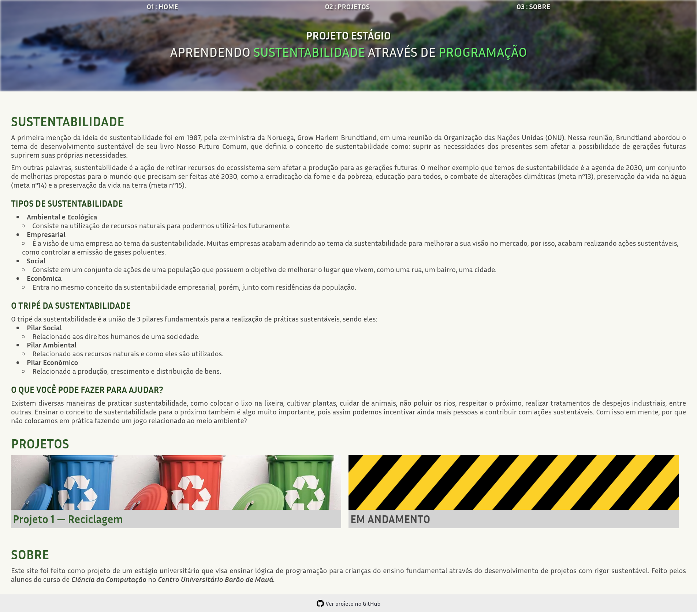

# Projeto Estágio

### Projeto desenvolvido em estágio supervisionado no [Centro Universitário Barão de Mauá](https://www.baraodemaua.br/)

## RESUMO

Este projeto objetiva ensinar crianças, estudantes da escola Barãozinho, Ribeirão Preto - SP, conceitos
básicos a respeito de programação, usando a ferramenta **Scratch**. Também
utilizaremos essas lições de informática como um pretexto para que tais crianças
tenham a oportunidade de aprender sobre **hábitos sustentáveis**, utilizando, por
exemplo, a criação de jogos virtuais relacionados à reciclagem. Acreditamos na
importância de tal projeto, pois ele constituiria uma oportunidade de levar
conhecimento envolvendo tecnologia e computação para tais crianças, bem como
engajar as mesmas a temas envolvendo o meio-ambiente. Portanto, desenvolvemos um website,
no qual constam definições e informações sobre o nosso trabalho.

## [CLIQUE PARA ACESSAR O WEBSITE](https://projeto-estagio.vercel.app/)

> **Página principal**

